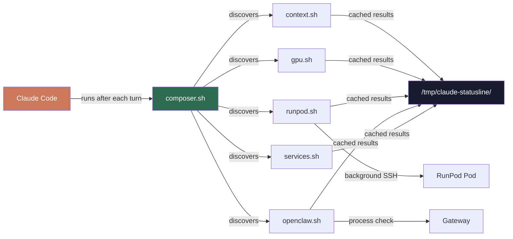

<div align="center">

# 📊 Statusline Factory

**Modular, auto-composing status line blocks for [Claude Code](https://claude.com/claude-code)**

See live training progress, server health, GPU usage, and project-specific metrics — right in your terminal's bottom bar.


</div>

```
🦞 up 2h | ecap: 3m ago  🚀 A100 31m $0.62 (my-pod) 🏋️ 200/625 (32%) ETA 1h04m  🎮 18.2/24G qwen3.5
```

> [!NOTE]
> **Each block only shows up when it has something worth showing.**
> No RunPod pod? That block is silent (0 tokens). GPU idle? Gone. All services healthy? Nothing. Only active concerns consume tokens — typically 5–25 tokens/turn depending on what's running.

---

## 💡 Why?

Long coding sessions lose track of what's running. A training job finishes and you don't notice for 20 minutes. A server crashes silently. Your context window fills up without warning.

Statusline Factory fixes that with **modular blocks** that show only what matters, right when it matters.

---

## ✨ Features

| | Feature | Detail |
|---|---------|--------|
| 🧩 | **Modular blocks** | Each concern is a standalone `.sh` script |
| 🔇 | **Self-suppressing** | No pod running? Block outputs nothing (0 tokens) |
| ⚡ | **Cached & async** | API/SSH calls run in background subshells, never block rendering |
| 🎨 | **Color-coded** | Green = healthy, Yellow = warning, Red = down |
| 📋 | **Copy-friendly** | Pod names, branches, ports — paste directly into chat |
| 🪙 | **Token-efficient** | ~25 tokens/turn worst case. [Full analysis →](references/token-cost.md) |

---

## 🏗️ Architecture



**How it works:** Claude Code calls `composer.sh` after each assistant message. The composer runs every block in `~/.claude/statusline-blocks/`. Each block checks its cache — if stale, it refreshes in a background subshell. Only cached results are read, so rendering is always instant.

---

## 📦 Included Blocks

| Block | Output | Visible when | Refresh |
|-------|--------|-------------|---------|
| `context` | `ctx:72%` | Context window > 50% | Every turn |
| `gpu` | `🎮 18.2/24G qwen3.5` | VRAM > 1GB in use | 30s |
| `runpod` | `🚀 A100 31m $0.62 (pod) 🏋️ 200/625 ETA 1h` | Pod running | 60s (pod) / 30s (training) |
| `openclaw` | `🦞 up 2h \| ecap: 3m ago` | Gateway running | 45s |
| `services` | `⚠ down: sop ollama` | Any service down | 120s |

> [!TIP]
> Each block's refresh interval is independently configurable. Edit the `AGE -gt <seconds>` value in the block script. See [token cost & refresh rates](references/token-cost.md).

---

## 🚀 Quick Start

**1. Copy blocks and composer:**
```bash
git clone https://github.com/starbuck100/statusline-factory.git
cd statusline-factory
mkdir -p ~/.claude/statusline-blocks
cp blocks/*.sh ~/.claude/statusline-blocks/
cp composer.sh ~/.claude/statusline.sh
chmod +x ~/.claude/statusline.sh ~/.claude/statusline-blocks/*.sh
```

**2. Enable in Claude Code** — add to `~/.claude/settings.json`:
```json
{
  "statusLine": {
    "type": "command",
    "command": "~/.claude/statusline.sh"
  }
}
```

**3. Done.** Claude Code hot-reloads — you should see the status line immediately.

---

## 🔧 Create Your Own Block

Every block follows this template:

```bash
#!/bin/bash
# Block: MyThing — one-line description
# Shows: 🔧 some-value
CACHE_DIR="/tmp/claude-statusline"
mkdir -p "$CACHE_DIR"
CACHE="$CACHE_DIR/mything"
AGE=999
[ -f "$CACHE" ] && AGE=$(( $(date +%s) - $(stat -c %Y "$CACHE" 2>/dev/null || echo 0) ))

if [ "$AGE" -gt 60 ]; then
  (
    # Your check here (API call, SSH, port check, etc.)
    echo "result" > "$CACHE"
  ) &  # MUST be background — don't block the status line
fi

VALUE=$(cat "$CACHE" 2>/dev/null)
[ -z "$VALUE" ] && exit 0  # Nothing = silent

echo -e "\033[32m🔧 $VALUE\033[0m"  # green=32, yellow=33, red=31
```

Save as `~/.claude/statusline-blocks/mything.sh` — the composer auto-discovers it.

<details>
<summary><strong>📚 Block design rules</strong></summary>

1. **Self-suppress** — `exit 0` with no output when irrelevant
2. **Cache slow ops** — background subshells, never block the render
3. **Be compact** — max ~50 chars per block, use abbreviations
4. **Color convention** — green=ok, yellow=warn, red=down
5. **Include identifiers** — pod names, branches, ports — things the user can copy-paste

**Common patterns:**
```bash
# Port check
ss -tlnp | grep -q ":8080 " && echo "up" || echo "DOWN"

# HTTP health
curl -s -o /dev/null -w "%{http_code}" --max-time 3 http://localhost:8080

# Process check
PID=$(pgrep -f "myapp"); [ -n "$PID" ] && ps -o %cpu= -p "$PID"

# Remote via SSH
ssh -o ConnectTimeout=3 user@host "tail -1 /var/log/training.log" 2>/dev/null
```

</details>

---

## 🪙 Token Cost

| Scenario | Tokens/turn |
|----------|------------|
| Nothing running | **0** |
| Only context warning | ~2 |
| Full stack (GPU + RunPod + training + services) | **~25** |

For comparison: a typical `CLAUDE.md` consumes **500–2000 tokens/turn**.

> [!IMPORTANT]
> Each block independently caches its data (30–120s intervals). Slow operations (API calls, SSH) run in background subshells and never block rendering. The status line reads only cached values — output is always instant.

---

## 🧠 Claude Code Skill

The `statusline-factory` skill teaches Claude Code to auto-create blocks for new projects:

```bash
mkdir -p ~/.claude/skills/statusline-factory
cp SKILL.md ~/.claude/skills/statusline-factory/
```

Then just tell Claude: *"create a statusline block for my Docker containers"* — it knows the template and conventions.

---

## 📜 License

MIT

</div>
